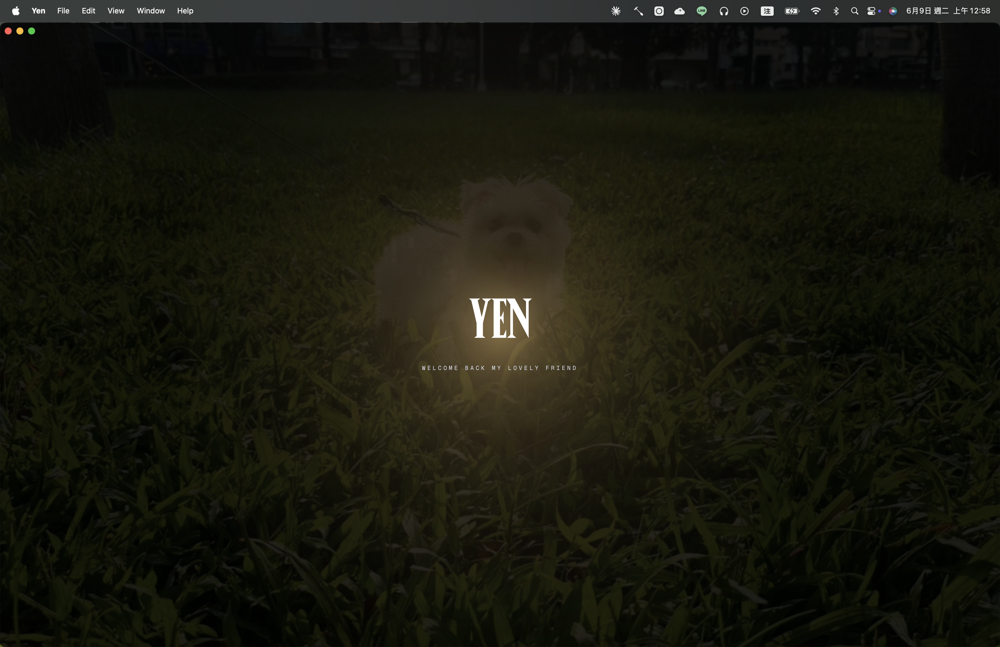
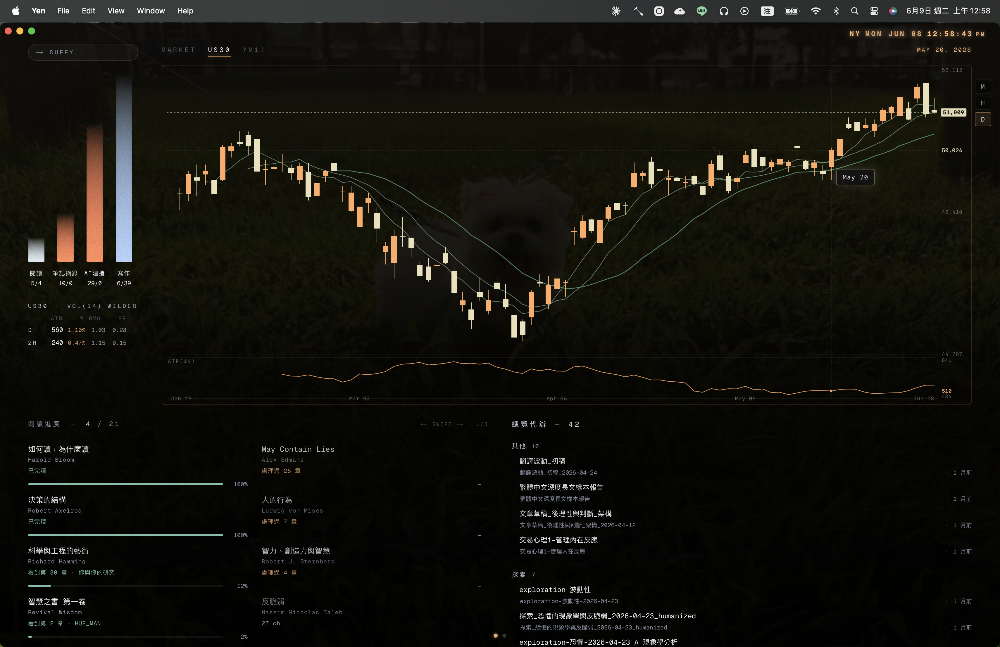

# Yen Hub

> 一個給知識工作者的桌面儀表板。把市場、閱讀、寫作、待辦、AI 對話收進同一個視窗，每天打開就掌握當下狀態。

---

## 這是什麼

**Yen Hub 是一個整合型的個人工作中樞 (personal hub)。**

現代知識工作者的工具是散落的：看盤要切到券商 App，追書進度在 Obsidian / Kindle，待辦在 Notion，AI 對話在 ChatGPT 視窗，寫作筆記又在另一個地方。每天一早，光是「看一遍所有要看的東西」就要切換四五個應用程式。

Yen Hub 把這些都收進**一個視窗**。打開就是當天的全景：US30 走勢、最近在讀什麼書讀到哪、今天的待辦、AI 教練（Duffy）對使用者的觀察與建議。不需要切換應用程式，不需要重新進入工作狀態。

它不是要做「另一個 Notion」、也不是要取代任何工具。它做的是**把現有工具的訊號集中起來**，讓使用者每天節省 15 分鐘的「找東西時間」、不再因為切換應用程式打斷思緒。

---

## 主畫面總覽

一個畫面四個區塊，分別對應一天裡最常需要回頭看的訊號：

| 區塊 | 內容 | 為什麼放在這 |
|---|---|---|
| **市場監看**（上）| US30 / YM1! 蠟燭圖 + ATR / RVOL 量能統計 | 開盤時段瞄一眼就知道波動性、要不要進場 |
| **注意力直方圖**（左上）| 過去 7 天在 vault 各區的「讀 / 寫 / AI 建造」活動 | 用視覺化的方式提醒：今天投資組合平衡嗎？該寫作了嗎？ |
| **閱讀進度立方體**（左下）| 所有在讀的書，顯示書名 / 作者 / 進度條 / 看到哪章 | 立方體可以滑動翻面看不同批次的書；**點任何一本書直接跳到 Obsidian 對應章節** |
| **總覽代辦**（右下）| 從 vault 抓出來的待辦，分群顯示 | 不用切到 Notion / Reminders；勾掉直接寫回 vault |
| **Duffy 教練**（左上角）| AI 教練 badge，點開進入對話頁 | 不是一般 chatbot：背後有對使用者的長期描繪（silhouette）、週摘要、跨對話記憶 |

---

## 設計緣由

這個 app 的每一個細節都是從**「使用者自己每天要用」**出發的——不是先有功能再找需求。

幾個能體現產品思考的設計選擇：

- **閱讀進度做成 3D 立方體**：使用者書多到一個畫面塞不下，但又不想做成 list 失去「全景感」。立方體可以塞 4 面（32 本），左右滑可以翻面，每本書同時看得到「進度多少」「最遠讀到哪一章」。
- **「處理過 N 章」vs「看到第 N 章」**：對於 AI 翻譯處理過、但使用者自己還沒讀的書，會用不同顏色標記——避免「進度條 90% 但其實沒讀」的假象。
- **點書直接開 Obsidian**：閱讀進度立方體不只是儀表板、也是入口。看到「這本最近沒進度」想繼續讀，**點一下就跳到上次讀到的那章**，不用再去 Obsidian 搜尋。
- **左上角的 Duffy badge**：AI 不是塞滿視窗的主角，而是「需要時叫得到」的角色。badge 平常呼吸，有想說的話會跳訊息。
- **整體配色與背景**：使用深色基底、奶油色字體、低彩度，搭配個人風格的背景圖。每天看的東西，視覺疲勞比資訊密度更重要。

---

## 關於這個專案的開發方式

> 這個段落單獨拉出來，因為它和產品本身一樣值得介紹。

Yen Hub 的**設計者、使用者、產品決策者是同一個人——非工程背景**。整個專案的程式碼是透過與 AI（Claude Code）密集協作完成的。

這不是「AI 寫了個東西、我貼上來」的故事。實際的工作分工是：

- **使用者負責**：定義要做什麼、定義成功長什麼樣子、決定設計選擇、判斷 AI 寫出來的成品對不對、踩進坑時主動觀察並引導 debug
- **AI 負責**：把使用者的需求翻譯成程式、提案技術路線、寫程式、解釋每個決策背後的取捨

過程中累積了一套**驗證方法論**：每次 AI 提出修改 → 在實機上跑 → 觀察行為 → 用 log 而不是直覺判斷對錯 → 把每一次踩坑寫成可重用的知識（[`DEVELOPING.md`](./DEVELOPING.md) 跟 vault 裡的決策文件）。這套方法論本身，比這個 app 還重要——它意味著：**「即使不會寫程式，依然可以擔任產品的最終決策者，把腦中的工具具體做出來」**。

對於正在進入 AI 時代的工作環境，這套能力可以複製到任何「我看到問題、但我自己不是執行者」的場景。

---

## 技術組成（給好奇的人）

- 桌面殼：**Tauri 2**（Rust）
- 前端：**Next.js 16** + React 19 + TypeScript
- AI：**Claude（Anthropic）** + Kimi，透過 Vercel AI SDK
- 認證：WebAuthn / Touch ID
- 資料來源：Obsidian vault（檔案系統直讀）、TwelveData（市場資料）

詳細的架構決策、開發流程、踩坑紀錄見 [`DEVELOPING.md`](./DEVELOPING.md)。

---

## 已知限制

- 目前只支援 macOS（Apple Silicon）
- 因為是個人工具，沒有公開發行；repo 公開是為了方便 AI 協作
- 未對外簽署 / 公證 → 第一次打開系統會跳防護提示

---

## 致謝

感謝 [Anthropic](https://www.anthropic.com/) 的 Claude 模型與 Claude Code 工具——讓「想做一個 app 但不會寫程式」這件事，從 2024 年的不可能變成 2026 年的「再花一個週末就能交付」。
